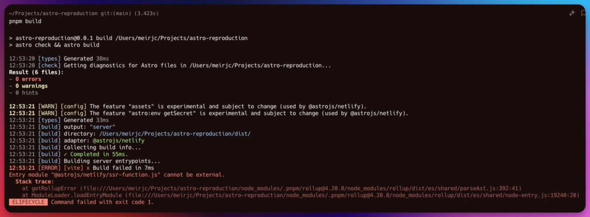

# New build error - Astro 4.13.4



I have been working on the project daily for the past 2-3 months.
updating the Astro packge and dependencies to the latest versions frequently using the `@astrojs/upgrade` command.
a few minutes ago, I ran the `@astrojs/upgrade` command and updated the Astro package from **`4.13.3`** to version **`4.13.4`**.

After the update, I ran the `pnpm build` command to build the project, but it failed. which is unusual because the build process has been working fine whenever I update the Astro package.

## Main tech stack

- Astro 4.13.4
- Svelte 4.2.18
- TypeScript 5.5.4
- TailwindCSS 3.4.10
- Directus SDK 17.0.0
- Nanostores 0.11.2

- The deployment adapter is `@astrojs/netlify` - this is a project i build in my company - and for now we uesd Netlify for dev deployment and doing qa.

## Complete process

1. Update Astro using the `@astrojs/upgrade`

```bash
# pnpm dlx @astrojs/upgrade

 astro   Integration upgrade in progress.

      ◼  @astrojs/check is up to date on v0.9.2
      ◼  @astrojs/netlify is up to date on v5.5.0
      ◼  @astrojs/svelte is up to date on v5.7.0
      ◼  @astrojs/tailwind is up to date on v5.1.0
      ◼  @astrojs/ts-plugin is up to date on v1.9.2
      ●  astro will be updated to v4.13.4

 ██████  Installing dependencies with pnpm...

╭─────╮  Houston:
│ ◠ ◡ ◠  Good luck out there.
╰─────╯
```

2. Ran `pnpm install` just to be sure all dependencies installed correctly.

```bash
❯ pnpm install

Lockfile is up to date, resolution step is skipped
Already up to date
Done in 640ms
```

3. Ran `pnpm astro check` to check for TypeScript errors.

```bash
❯ pnpm astro check

> @0.0.1 astro /Users/meirjc/Projects/XXXXXXX/XXXXXXXXX
> astro "check"

12:02:14 [types] Generated 158ms
12:02:14 [check] Getting diagnostics for Astro files in /Users/meirjc/Projects/XXXXXXX/XXXXXXXXX...
Result (106 files):
- 0 errors
- 0 warnings
- 0 hints
```

4. Ran `pnpm build` to build the project.

_(this is a long process, so I'm not including the full output here - just the error message and the last few lines of the output)_

```bash
❯ pnpm build

> @0.0.1 build /Users/meirjc/Projects/XXXXXXX/XXXXXXXXX
> astro check && astro build

12:04:35 [types] Generated 151ms
12:04:35 [check] Getting diagnostics for Astro files in /Users/meirjc/Projects/XXXXXXX/XXXXXXXXX...
Result (106 files):
- 0 errors
- 0 warnings
- 0 hints

12:04:40 [WARN] [config] The feature "assets" is experimental and subject to change (used by @astrojs/netlify).
12:04:40 [WARN] [config] The feature "astro:env getSecret" is experimental and subject to change (used by @astrojs/netlify).
12:04:40 [types] Generated 144ms
12:04:40 [build] output: "server"
12:04:40 [build] directory: /Users/meirjc/Projects/XXXXXXX/XXXXXXXXX/dist/
12:04:40 [build] adapter: @astrojs/netlify
12:04:40 [build] Collecting build info...
12:04:40 [build] ✓ Completed in 169ms.
12:04:40 [build] Building server entrypoints...
12:04:40 [ERROR] [vite] x Build failed in 9ms
Entry module "@astrojs/netlify/ssr-function.js" cannot be external.
  Stack trace:
    at getRollupError (file:///Users/meirjc/Projects/XXXXXXX/XXXXXXXXX/node_modules/.pnpm/rollup@4.20.0/node_modules/rollup/dist/es/shared/parseAst.js:392:41)
    at ModuleLoader.loadEntryModule (file:///Users/meirjc/Projects/XXXXXXX/XXXXXXXXX/node_modules/.pnpm/rollup@4.20.0/node_modules/rollup/dist/es/shared/node-entry.js:19240:20)
 ELIFECYCLE  Command failed with exit code 1.
```

These are just the error lines

```bash
12:04:40 [ERROR] [vite] x Build failed in 9ms
Entry module "@astrojs/netlify/ssr-function.js" cannot be external.
  Stack trace:
    at getRollupError (file:///Users/meirjc/Projects/XXXXXXX/XXXXXXXXX/node_modules/.pnpm/rollup@4.20.0/node_modules/rollup/dist/es/shared/parseAst.js:392:41)
    at ModuleLoader.loadEntryModule (file:///Users/meirjc/Projects/XXXXXXX/XXXXXXXXX/node_modules/.pnpm/rollup@4.20.0/node_modules/rollup/dist/es/shared/node-entry.js:19240:20)
 ELIFECYCLE  Command failed with exit code 1.
```

These are all the dependencies frmo the `package.json`

```json
  "dependencies": {
    "@astrojs/check": "^0.9.2",
    "@astrojs/netlify": "^5.5.0",
    "@astrojs/svelte": "^5.7.0",
    "@astrojs/tailwind": "^5.1.0",
    "@astrojs/ts-plugin": "^1.9.2",
    "@directus/sdk": "^17.0.0",
    "@nanostores/persistent": "^0.10.2",
    "astro": "^4.13.4",
    "blaze-slider": "^1.9.3",
    "nanostores": "^0.11.2",
    "svelte": "^4.2.18",
    "tailwind-merge": "^2.5.2",
    "tailwindcss": "^3.4.10",
    "typescript": "^5.5.4",
    "zod": "^3.23.8"
  },
  "devDependencies": {
    "@tailwindcss/typography": "^0.5.14",
    "prettier": "^3.3.3",
    "prettier-plugin-astro": "^0.14.1",
    "prettier-plugin-svelte": "^3.2.6",
    "prettier-plugin-tailwindcss": "^0.6.6"
  },
```

`astro.config.mjs` file

```js
import { defineConfig } from "astro/config";
import tailwind from "@astrojs/tailwind";
import svelte from "@astrojs/svelte";
import netlify from "@astrojs/netlify";

// https://astro.build/config
export default defineConfig({
  integrations: [tailwind(), svelte()],
  output: "server",
  adapter: netlify()
});
```

I have been working on this projects for few, and I have never encountered this error before.
just this update from `4.13.3` to `4.13.4`.
